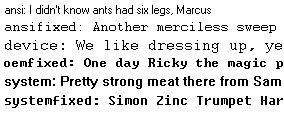

## TKinter Guide

Compiled from https://effbot.org (https://effbot.org/tkinterbook/tkinter-index.htm)

---

### Widget Classes

**Button** - A simple button, used to execute a command or other operation
**Canvas** - Structured graphics. Used to draw graphs and plots, create graphic editors, and to implement custom widgets.
**Checkbutton** - Represents a variable that can have two distinct values. Clicking the button toggles between the values.
**Entry** - A text entry field.
**Frame** - A container widget. The frame can have a border and a background, and is used to group widgets when creating an application or dialog layout.
**Label** - Displays text or an image.
**Labelframe** - A variant of the Frame widget that can draw both a border and a title.
**Listbox** - Displays a list of alternatives. The listbox can be configured to get radiobutton or checklist behavior.
**Menu** - A menu pane. Used to implement pulldown and popup menus.
**Menubutton** - A menubutton. Used to implement pulldown menus.
**Message** - Display a text message. Similar to the label widget, but can automatically wrap text to a given width or aspect ratio.
**PanedWindow** - A container widget that organizes child widgets in resizable panes.
**Radiobutton** - Represents one value of a variable that can have one of many values. Clicking the button sets the variable to that value, and clears all other radiobuttons associated with the same variable.
**Scale** - Allows you to set a numerical value by dragging a "slider".
**Scrollbar** - Standard scrollbars for use with canvas, entry, listbox, and text widgets.
**Spinbox** - A variant of the Entry widget for selecting values from a range or an ordered set.
**Text** - Formatted text display. Allows you to display and edit text with various styles and attributes. Also supports embedded images and windows.
**Toplevel** - A container widget displayed as a separate, top-level window.

#### Mixins

**Grid** - The grid geometry manager allows you to create table-like layouts, by organizing the widgets in a 2-dimensional grid. To use this geometry manager, use the _**grid**_ method.
**Pack** - The pack geometry manager lets you create a layout by "packing" the widgets into a parent widget, by treating them as rectangular blocks placed in a frame. To use this geometry manager for a widget, use the _**pack**_ method on that widget to set things up.
**Place** - The place geometry manager lets you explicitly place a widget in a given position. To use this geometry manager, use the _**place**_ method.

---

### Widget configuration

##### Create a widget instance:

`widgetclass(master,option=value, ...)` => widget

(where widgetclass is one of the widget classes mentioned earlier)

Create an instance of this widget class, as a child to the given master, and using the given options. All options have default values, so in the simplest case, you only have to specify the master. You can even leave that out if you really want; Tkinter then uses the most recently created root window as master. Note that the name option can only be set when the widget is created.

##### Pull value from current option

`cget("option")` => string

Return the current value of an option. Both the option name, and the returned value, are strings. To get the name option, use str(widget) instead.

##### Set a option value

`config(option=value, ...)`
`configure(option=value, ...)`

Set one or more options (given as keyword arguments).

Note that some options have names that are reserved words in Python (class, from, …). To use these as keyword arguments, simply append an underscore to the option name (class*, from*, …). Note that you cannot set the name option using this method; it can only be set when the widget is created.

For convenience, the widgets also implement a partial dictionary interface. The **setitem** method maps to configure, while **getitem** maps to cget. As a result, you can use the following syntax to set and query options:

value = widget["option"]
widget["option"] = value

Note that each assignment results in one call to Tk. If you wish to change multiple options, it is usually a better idea to change them with a single call to config or configure (personally, I prefer to always change options in that fashion).

##### Return all options available for a widget

`keys()` => list

Return a list of all options that can be set for this widget. The name option is not included in this list (it cannot be queried or modified through the dictionary interface anyway, so this doesn’t really matter).

---

### Widget Styling

##### Colors

Most widgets allow you to specify the widget and text colors, using the background and foreground options. To specify a color, you can either use a color name, or explicitly specify the red, green, and blue (RGB) color components.

##### Color names

Tkinter includes a color database which maps color names to the corresponding RGB values. This database includes common names like Red, Green, Blue, Yellow, and LightBlue, but also more exotic things like Moccasin, PeachPuff, etc.

On an X window system, the color names are defined by the X server. You might be able to locate a file named xrgb.txt which contains a list of color names and the corresponding RGB values. On Windows and Macintosh systems, the color name table is built into Tk.

Under Windows, you can also use the Windows system colors (these can be changed by the user via the control panel):

```
     SystemActiveBorder, SystemActiveCaption, SystemAppWorkspace,
     SystemBackground, SystemButtonFace, SystemButtonHighlight,
     SystemButtonShadow, SystemButtonText, SystemCaptionText,
     SystemDisabledText, SystemHighlight, SystemHighlightText,
     SystemInactiveBorder, SystemInactiveCaption, SystemInactiveCaptionText,
     SystemMenu, SystemMenuText, SystemScrollbar, SystemWindow,
     SystemWindowFrame, SystemWindowText.
```

On the Macintosh, the following system colors are available:

```
     SystemButtonFace, SystemButtonFrame, SystemButtonText, SystemHighlight,
     SystemHighlightText, SystemMenu, SystemMenuActive, SystemMenuActiveText,
     SystemMenuDisabled, SystemMenuText, SystemWindowBody.
```

Color names are case insensitive. Many (but not all) color names are also available with or without spaces between the words. For example, “lightblue”, “light blue”, and “Light Blue” all specify the same color.

##### RGB Specifications

If you need to explicitly specify a color, you can use a string with the following format:

#RRGGBB

RR, GG, BB are hexadecimal representations of the red, green and blue values, respectively. The following sample shows how you can convert a color 3-tuple to a Tk color specification:

tk_rgb = "#%02x%02x%02x" % (128, 192, 200)

Tk also supports the forms “#RGB” and “#RRRRGGGGBBBB” to specify each value with 16 and 65536 levels, respectively.

You can use the winfo_rgb widget method to translate a color string (either a name or an RGB specification) to a 3-tuple:

rgb = widget.winfo_rgb("red")
red, green, blue = rgb[0]/256, rgb[1]/256, rgb[2]/256

Note that winfo_rgb returns 16-bit RGB values, ranging from 0 to 65535. To map them into the more common 0-255 range, you must divide each value by 256 (or shift them 8 bits to the right).

##### Fonts

Widgets that allow you to display text in one way or another also allows you to specify which font to use. All widgets provide reasonable default values, and you seldom have to specify the font for simpler elements like labels and buttons.

Fonts are usually specifed using the font widget option. Tkinter supports a number of different font descriptor types:

    Font descriptors

    User-defined font names

    System fonts

    X font descriptors

With Tk versions before 8.0, only X font descriptors are supported (see below).

##### Font Descriptors

Starting with Tk 8.0, Tkinter supports platform independent font descriptors. You can specify a font as tuple containing a family name, a height in points, and optionally a string with one or more styles. Examples:

("Times", 10, "bold")
("Helvetica", 10, "bold italic")
("Symbol", 8)

To get the default size and style, you can give the font name as a single string. If the family name doesn’t include spaces, you can also add size and styles to the string itself:

"Times 10 bold"
"Helvetica 10 bold italic"
"Symbol 8"

Here are some families available on most Windows platforms:

**Arial** (corresponds to Helvetica), **Courier New** (Courier), **Comic Sans MS**, **Fixedsys**, **MS Sans Serif**, **MS Serif**, **Symbol**, **System**, **Times New Roman** (Times), and **Verdana**:


Note that if the family name contains spaces, you must use the tuple syntax described above.

The available styles are **normal**, **bold**, **roman**, **italic**, **underline**, and **overstrike**.

Tk 8.0 automatically maps **Courier**, **Helvetica**, and **Times** to their corresponding native family names on all platforms. In addition, a font specification can never fail under Tk 8.0; if Tk cannot come up with an exact match, it tries to find a similar font. If that fails, Tk falls back to a platform-specific default font. Tk’s idea of what is “similar enough” probably doesn’t correspond to your own view, so you shouldn’t rely too much on this feature.

Tk 4.2 under Windows supports this kind of font descriptors as well. There are several restrictions, including that the family name must exist on the platform, and not all the above style names exist (or rather, some of them have different names).

##### Font names

In addition, Tk 8.0 allows you to create named fonts and use their names when specifying fonts to the widgets.

The **tkFont** module provides a Font class which allows you to create font instances. You can use such an instance everywhere Tkinter accepts a font specifier. You can also use a font instance to get font metrics, including the size occupied by a given string written in that font.

tkFont.Font(family="Times", size=10, weight=tkFont.BOLD)
tkFont.Font(family="Helvetica", size=10, weight=tkFont.BOLD,
slant=tkFont.ITALIC)
tkFont.Font(family="Symbol", size=8)

If you modify a named font (using the **config** method), the changes are automatically propagated to all widgets using the font.

The **Font** constructor supports the following style options (note that the constants are defined in the **tkFont** module):

**family** - Font family.

**size** - Font size in points. To give the size in pixels, use a negative value.

**weight** - Font thickness. Use one of **NORMAL** or **BOLD**. Default is **NORMAL**.

**slant** - font slant. Use one of **NORMAL** or **ITALIC**. Default is **NORMAL**.

**underline** - Font underlining. If 1 (true), the font is underlined. Default is 0 (false).

**overstrike** - Font strikeout. If 1 (true), a line is drawn over text written with this font. Default is 0 (false).

##### System Fonts

Tk also supports system specific font names. Under X, these are usually font aliases like fixed, 6x10, etc.

Under Windows, these include **ansi**, **ansifixed**, **device**, **oemfixed**, **system**, and **systemfixed**:



On the Macintosh, the system font names are **application** and **system**.

Note that the system fonts are full font names, not family names, and they cannot be combined with size or style attributes. For portability reasons, avoid using these names wherever possible.

##### Text formatting

While text labels and buttons usually contain a single line of text, Tkinter also supports multiple lines. To split the text across lines, simply insert newline characters (**\n**) where necessary.

By default, the lines are centered. You can change this by setting the **justify** option to **LEFT** or **RIGHT**. The default value is **CENTER**.

You can also use the **wraplength** option to set a maximum width, and let the widget wrap the text over multiple lines all by itself. Tkinter attempts to wrap on whitespace, but if the widget is too narrow, it may break individual words across lines.

##### Borders

All Tkinter widgets have a border (though it’s not visible by default for some widgets). The border consists of an optional 3D relief, and a focus highlight region.

##### Relief

The relief settings control how to draw the widget border:

**borderwidth** (or **bd**) - This is the width of the border, in pixels. Most widgets have a default borderwidth of one or two pixels. There’s hardly any reason to make the border wider than that.

**relief** - This option controls how to draw the 3D border. It can be set to one of **SUNKEN**, **RAISED**, **GROOVE**, **RIDGE**, and **FLAT**.

##### Focus highlights

The highlight settings control how to indicate that the widget (or one of its children) has keyboard focus. In most cases, the highlight region is a border outside the relief. The following options control how this extra border is drawn:

**highlightcolor** - This option is used to draw the highlight region when the widget has keyboard focus. It’s usually black, or some other distinct contrast color.

**highlightbackground** - This option is used to draw the highlight region when the widget doesn’t have focus. It’s usually same as the widget background.

**highlightthickness** - This option is the width of the highlight region, in pixels. It is usually one or two pixels for widgets that can take keyboard focus.

##### Cursors

**cursor** - This option controls which mouse cursor to use when the mouse is moved over the widget.

If this option isn’t set, the widget uses the same mouse pointer as its parent.

Note that some widgets, including the **Text** and **Entry** widgets, set this option by default.


---

### Events and Bindings

##### Capturing clicks in a window

```
from Tkinter import *

root = Tk()

def callback(event):
    print "clicked at", event.x, event.y

frame = Frame(root, width=100, height=100)
frame.bind("<Button-1>", callback)
frame.pack()

root.mainloop()
```

In this example, we use the bind method of the frame widget to bind a callback function to an event called <Button-1>. Run this program and click in the window that appears. Each time you click, a message like “clicked at 44 63” is printed to the console window.

##### Capturing keyboard events

Keyboard events are sent to the widget that currently owns the keyboard focus. You can use the focus_set method to move focus to a widget:

```
from Tkinter import *

root = Tk()

def key(event):
    print "pressed", repr(event.char)

def callback(event):
    frame.focus_set()
    print "clicked at", event.x, event.y

frame = Frame(root, width=100, height=100)
frame.bind("<Key>", key)
frame.bind("<Button-1>", callback)
frame.pack()

root.mainloop()
```

If you run this script, you’ll find that you have to click in the frame before it starts receiving any keyboard events.
